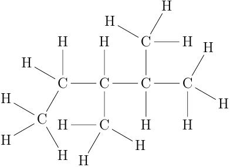

## Sheet 5

### Task 1  (Wiener index and boiling points)

Given the following graph $G$ representing the chemical compound
2,3-dimethylpentan:

1.  Determine the edge-weight matrix of the graph of the carbon
    backbone.

2.  Determine the distance matrix.

3.  Determine the Wiener-Index.

4.  Determine the number of shortest paths of length 3.

5.  Determine the value $p_0$ and $w_0$ of the formula for predicting
    the boiling point for this compound.

6.  Determine the estimated boiling points and compare it to the real
    boiling point.

7.  What is the asymptotic worst case performance for finding the
    distance matrix based on repeated squaring?

8.  Do you know a method that has a better asymptotic worst case
    performance?

### Task 2 (From random polygon to an ellipse)

Given the matrices $$M_3 = \frac{1}{2}\left(\begin{array}{ccc}
1 & 1 & 0\\
0 & 1 & 1\\
1 & 0 & 1
\end{array}\right)$$ and $$M_4 =  \frac{1}{2}\left(\begin{array}{cccc}
1 & 1 & 0 & 0  \\
0 & 1 & 1 & 0  \\
0 & 0 & 1 & 1  \\
1 & 0 & 0 & 1  
\end{array}\right)$$

1.  How do these matrices relate to the lecture "From Random Polygon to
    Ellipse"?

2.  Which of these matrices is invertible?

3.  Compute the determinant of $M_3$ and $M_4$.

4.  Are the columns of $M_3$ independent? Are the columns of $M_4$
    independent?

5.  If $A$ is a triangular matrix, i.e. $a_{ij}=0$, whenever $i>j$ or,
    alternatively, whenever $i<j$, then its determinant equals the
    product of the diagonal entries.

    Use this fact is order to prove for all values of $k\geq 3$ if the
    matrix $M_k$ is invertible or is not invertible.

6.  Draw an equilateral triangle with points $(x_1^k, y_1^k)$,
    $(x_2^k, y_2^k)$, and $(x_3^k, y_3^k)$. Assume the triangle is a
    result of $M_3\cdot x^{k-1}$ and $M_3\cdot y^{k-1}$ as presented in
    the lecture. Ignoring normalization, find $x^{k-1}$ and $y^{k-1}$.
    Can you find several solutions for $x^{k-1}$ and $y^{k-1}$?

7.  Draw a square with points $(x_1^k, y_1^k)$, $(x_2^k, y_2^k)$,
    $(x_3^k, y_3^k)$, and $(x_4^k, y_4^k)$ . Assume the square is a
    result of $M_4\cdot x^{k-1}$ and $M_4\cdot y^{k-1}$ as presented in
    the lecture. Ignoring normalization, find $x^{k-1}$ and $y^{k-1}$.
    Can you find several solutions for $x^{k-1}$ and $y^{k-1}$? What is
    the conclusion wrt. the (non-)existence of an inverse of $M_4$?

### Task 3 (From random polygon to an ellipse)

Given vector $v=(v_1, \ldots, v_5) = (0,3,-1,11,-3)$.

1.  Determine $w=v-\overline{v}$, where $\overline{v}$ is a vector where
    each entry is the mean of all values $v_i$.

2.  Determine $\frac{w}{||w||_2}$, where $||\cdot||_2$ refers to the
    2-norm.

3.  What is the length of vector $\frac{w}{\|\| w \|\|_2}$?

### Task 4 (From random polygon to an ellipse)

1.  Use python to compute 0.1 + 0.2. See\
    <https://docs.python.org/3/tutorial/floatingpoint.html> for an
    introduction to understand the results your observe.

2.  Study the three examples of python code reported below. Essentially, in
    all three examples a function $f$ is applied $c$ times, and then
    $f^{-1}$ is applied $c$ times.

    a.  Which result is expected mathematically?

    b.  Without running the code: which of the three examples might
        suffer from numerical issues "most"?

    c.  Without running the code: for which values of $c$ do you expect
        to see numerical issues?

    d.  Why is this related to the lecture "From Random Polygon to
        Ellipse"?


#Example 1
for c in range(2000):
    a=1.0
    for i in range(c):
        a=a/2
    
    for i in range(c):
        a=a*2
    
    print(c,a)

#Example 2
for c in range(2000):
    a=1.0
    for i in range(c):
        a=a/2+1.0
    
    for i in range(c):
        a=(a-1.0)*2
    
    print(c,a)

#Example 3
for c in range(2000):
    a=1.0
    for i in range(c):
        a=a/2+10000.0
    
    for i in range(c):
        a=(a-10000.0)*2
    
    print(c,a)


