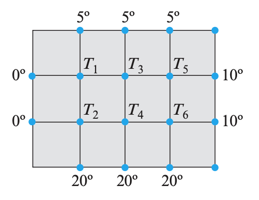

## Task 1: Linear Programming by Affine Scaling 

Implement in python the affine-scaling method and solve the following problem:

$$
\begin{array}{rl}
  \max\;& z=x_1+2x_2\\
  &x_1+x_2\leq 8\\
  &x_1\geq 0,x_2\geq 0 
\end{array}
$$

It is the same problem as seen in the slides. But now solve it assuming the starting solution is $[x_1, x_2]=[1, 3]$. The optimal solution is $[0,8]$.

You can then solve also the following problem:

$$
\begin{array}{rl}
\text{maximize} \;\;&2x1 + 3x2 + 2x3 \\
\text{subject to} \; \; &x1 + x2 +2x3 = 3\\
&x1,x2,x3 \geq 0.
\end{array}
$$

using as starting solution $[x_1, x_2, x_3]=[1, 3/2, 1/4]$.

How should the algorithm change if the problem was a minimization problem?

## Task 2: Linear Programming for Project Selection

Model in linear programming terms the following problem: Given a set of
projects to invest on, each with a cost and an expected profit, determine which
to include in a collection so that the total cost is less than or
equal to a given budget and the total expected profit is as large as possible.
Reason about the nature of the variables, continuous or discrete.

Solve the instance of the problem given in the python code below in two ways:

- with `scipy.optimization.linprog` from the latest versions of scipy,

- with your implementation of the Affine Scaling method seen in the lecture.


The previous solution methods will only solve the continuous variables case. It is
anyway a good exercise to solve the problem with continuous variables
and then try to derive an integer solution from the fractional one. How
would you do? 

<!--
Compare your results with the optimal integer solution for
this instance has objective function value: 2397.
-->


```{python}
import numpy as np

num_items=100
capacity=997
profit = np.array([585, 194, 426, 606, 348, 516, 521, 1092, 422, 749, 895, 337, 143, 557, 945, 915, 1055, 546, 352, 522, 109, 891, 1001, 459, 222, 767, 194, 698, 838, 107, 674, 644, 815, 434, 982, 866, 467, 1094, 1084, 993, 399, 733, 533, 231, 782, 528, 172, 800, 974, 717, 238, 974, 956, 820, 245, 519, 1095, 894, 629, 296, 299, 1097, 377, 216, 197, 1008, 819, 639, 342, 807, 207, 669, 222, 637, 170, 1031, 198, 826, 700, 587, 745, 872, 367, 613, 1072, 181, 995, 1043, 313, 158, 848, 403, 587, 864, 1023, 636, 129, 824, 774, 889])
cost = np.array([485, 94, 326, 506, 248, 416, 421, 992, 322, 649, 795, 237, 43, 457, 845, 815, 955, 446, 252, 422, 9, 791, 901, 359, 122, 667, 94, 598, 738, 7, 574, 544, 715, 334, 882, 766, 367, 994, 984, 893, 299, 633, 433, 131, 682, 428, 72, 700, 874, 617, 138, 874, 856, 720, 145, 419, 995, 794, 529, 196, 199, 997, 277, 116, 97, 908, 719, 539, 242, 707, 107, 569, 122, 537, 70, 931, 98, 726, 600, 487, 645, 772, 267, 513, 972, 81, 895, 943, 213, 58, 748, 303, 487, 764, 923, 536, 29, 724, 674, 789])
```


## Task 3

Show that if $A$ is a square matrix that can be reduced to a row echelon form $U$ by
Gaussian elimination without row interchanges, then $A$ can be factored
as $A = LU$, where $L$ is a lower triangular matrix.

Show that the LU decomposition can be rewritten as 
$$
    A=LDU
$$
where now both the lower
triangular factor and the upper triangular factor have 1's on the main diagonal.


## Task 4

Propose and efficient method for solving $Ax=b$ and $A^T\tilde{x}=\tilde{b}$.


## Task 5

Find the LU decomposition of the matrix 

$$
A=\begin{bmatrix}
3 &−6 &−3 \\
2 &0 &6 \\
−4 &7 &4 
\end{bmatrix}.
$$

Using the decomposition:

- solve the system of linear equations: $Ax=b$ when $b=[-3, -22, 3]$
- find the inverse of $A$.


## Task 6

Software libraries vary in how they handle LU-decompositions. For example, many libraries perform row interchanges to reduce roundoff error and hence produce PLU-decompositions, even when asked for LU-decompositions. Find out which function(s) performs the LU-decomposition in Python Scipy and see what happens when you use scipy to find an LU-decomposition of the matrix from the previous task. (Hint: compare `scipy.linalg.lu`, `scipy.linalg.lu_factor`, `scipy.linalg.lu_solve`, `scipy.sparse.linalg.splu`). Update your implementation of Task 1 such that it does not need to compute any matrix inversion.

## Task 7: Modeling

The figure below shows a metal plate whose edges are held at the temperatures shown. It follows from thermodynamic principles that the temperature at each of the six interior nodes will eventually stabilize at a value that is approximately the average of the temperatures at the four neighboring nodes. These are called the steady-state temperatures at the nodes. 

<!-- Thus, for example, if we denote the steady-state temperatures at the interior nodes in the figure as $T_1, T_2, T_3, T_4, T_5$, and $T_6$, then at the node labeled $T_1$ that temperature will be T1 = 41 (0 + 5 + T2 + T3) or, equivalently,
4T1 − T2 − T3 = 5
-->
Find a linear system whose solution gives the steady-state temperatures at the nodes, and use scipy to solve that system by LU-decomposition.


